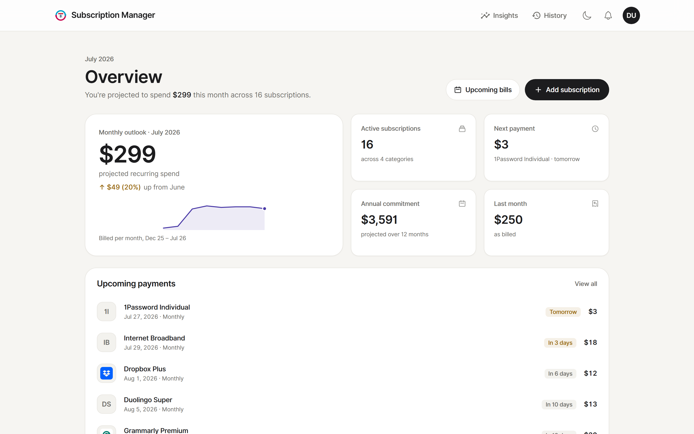
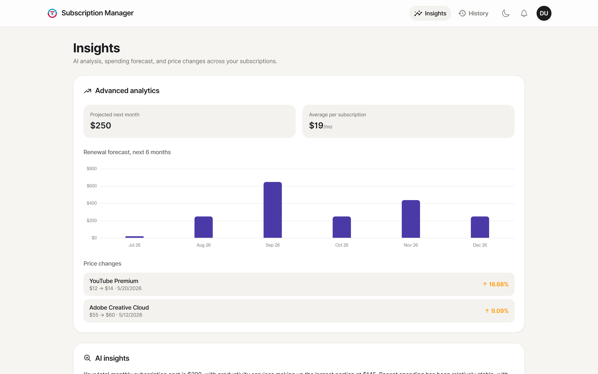
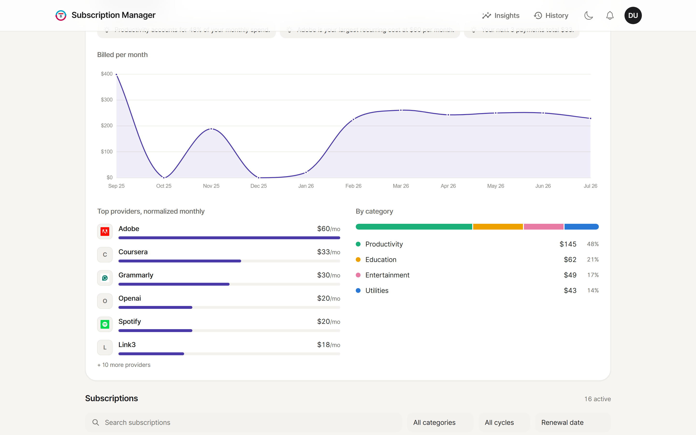
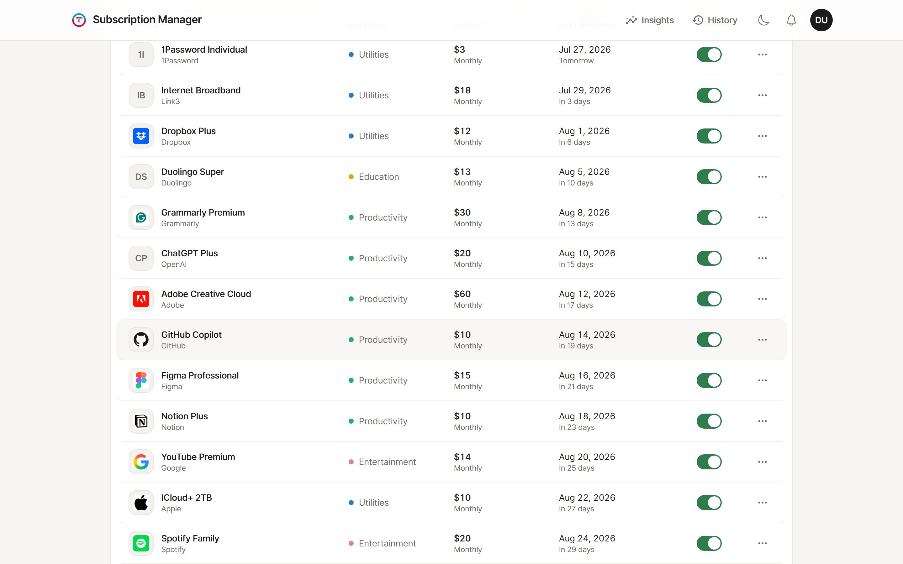
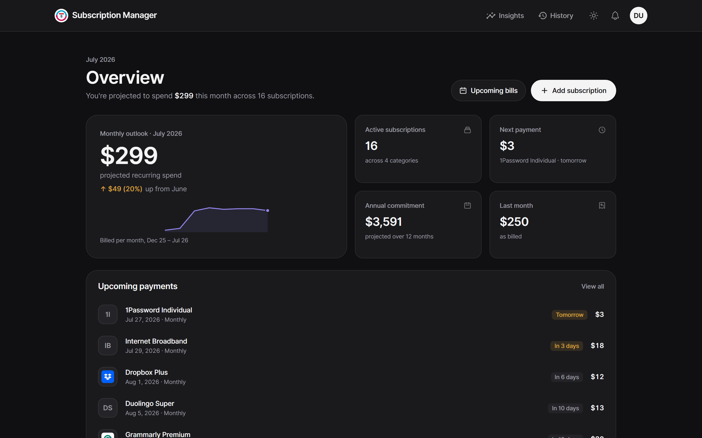

# Subscription Manager

A web app for keeping track of what you're subscribed to — the slow drip of
Netflix, Spotify, iCloud and everything else — so you actually know what you're
paying and when the next charge hits.



---

## What it does

**The dashboard.** Add a subscription with its amount, currency, billing cycle
and renewal date, and the overview answers the only questions that matter: what
you're spending this month, what's about to be charged, and where the money
actually goes. Upcoming payments are ordered by how soon they land; the outlook
card compares this month against last.

**Multi-currency without losing precision.** You enter an amount in whatever
currency you're billed in. The server converts to USD with live rates (cached
12h, static fallback) and stores *both* the original and the normalised value,
so nothing gets mangled by round-tripping. Every total, chart and forecast reads
the normalised column; nothing re-converts on the way to the screen.

**Gating that actually gates.** Free caps you at 10 subscriptions, Premium
lifts it. The cap and every premium feature are enforced in the resolvers
against `server/config/plans.js` — not hidden in the UI and hoped for.

**Insights.** A six-month spend forecast built by walking each subscription's
real billing schedule forward, so an annual renewal shows up as the spike it is
rather than being smeared into a monthly average. Alongside it, price-change
detection reads your transaction history and tells you which services quietly
went up, by how much, and when.

**AI insights.** A short, plain-language read on your spending — specific about
your services and amounts, written in your own currency. It calls an
OpenAI-compatible API, caches the result, and regenerates only when your data
actually changes, so there's no "generate" button to babysit.

**Renewals, everywhere you look.** A nightly cron rolls billing cycles forward
and sends reminders — email plus in-app notifications — at as many lead times as
you pick. Connect Google Calendar and renewals appear as events that add, update
and remove themselves as you edit subscriptions; there's also a private `.ics`
feed if you'd rather subscribe from Apple or Outlook.

Plus: month-by-month transaction history you can edit by hand, per-provider and
per-category breakdowns, saved payment methods, email verification and password
reset, dark mode, and a Stripe-shaped billing seam.

## Screenshots

| | |
|---|---|
|  |  |
| Forecast and price changes | Where the money goes |
|  |  |
| Every subscription, one table | Dark mode |

More in [`docs/screenshots`](docs/screenshots) — AI insights, history, plan and
reminder settings, and the mobile layout.

## Tech

| | |
|---|---|
| **Frontend** | React 19, Vite, Tailwind v4, Apollo Client, Chart.js, Framer Motion, React Router |
| **Backend** | Node, Express 5, Apollo Server 5, GraphQL, Passport (sessions), Helmet |
| **Data** | MongoDB via Mongoose |
| **Services** | Nodemailer (reminders, verification), Google Calendar, an OpenAI-compatible API for insights, Stripe (seam only) |

## Running it

**Requirements:** Node 20+, a MongoDB connection string (Atlas works).

```bash
npm install
npm install --prefix client
cp .env.example .env          # MONGO_URI and SESSION_SECRET at minimum

npm run dev                   # API on :4000
npm run dev --prefix client   # client on :5173, separate terminal
```

AI and Google Calendar are optional. Leave their keys blank and those features
report "not configured" rather than breaking.

For production:

```bash
npm run build   # builds the client into client/dist
npm start       # serves the API and the built client from one origin
```

Tests are plain `node:test` (`npm test`). They cover the things that are easy to
get subtly wrong: input validation, billing-date math, plan gating, the iCal
builder, reminder lead-time resolution, and the token encryption / signed OAuth
state.

### Environment

The full list is in `.env.example`; these are the ones that matter:

| Variable | When you need it | What it's for |
| --- | --- | --- |
| `MONGO_URI` | always | MongoDB connection string |
| `SESSION_SECRET` | always | Signs sessions, and derives the key used to encrypt stored OAuth tokens |
| `APP_URL` | production | Public base URL — builds the `.ics` feed and the Google OAuth redirect |
| `CLIENT_URL` | production | CORS origin and where OAuth redirects land |
| `GMAIL_USER` / `GMAIL_PASS` | for email | Gmail SMTP (use an App Password) |
| `AI_API_KEY` (+ `AI_BASE_URL`, `AI_MODEL`) | for AI insights | OpenAI-compatible key; defaults target Groq / `llama-3.3-70b-versatile` |
| `GOOGLE_CLIENT_ID` / `GOOGLE_CLIENT_SECRET` | for calendar sync | OAuth client credentials |
| `STRIPE_SECRET_KEY` | for real billing | Unset = mock mode (plan changes apply immediately) |

Google Calendar is the fiddly one: create an OAuth 2.0 **Web application**
client in Google Cloud Console, enable the Calendar API, and add
`<APP_URL>/auth/google/calendar/callback` to its authorised redirect URIs — it
has to match exactly, trailing slashes and all. The scopes it asks for are
`openid`, `email` and `calendar.events`.

## How it's laid out

```
client/src
  pages/                  routed screens — dashboard, insights, history, settings
  components/dashboard/   the cards, charts, filters and subscription table
  context/                currency and theme
  lib/                    dashboard math, the plan/feature hook, provider logos
server
  resolvers/              one per domain; each re-checks ownership and plan
  services/               anything that talks outward — AI, Google Calendar, billing
  routes/                 the .ics feed and OAuth redirects, which sit outside GraphQL
  jobs/                   cron — billing rollover, reminders, keep-alive
  config/plans.js         what each plan includes
  utils/                  validation, billing dates, currency, iCal, planGuard
```

Two ideas carry most of the app:

**Every amount is stored twice.** A subscription keeps `originalAmount` /
`originalCurrency` exactly as you entered it, and `costInDollar` as the
normalised value at the time of entry. Totals, charts, forecasts and the AI
prompt all read the normalised column, so a rate move never rewrites your
history — and the display layer never has to convert anything, which is what
keeps a ৳2,200 broadband bill and a $15.49 Netflix bill addable in the first
place.

**Plans are a table, not a scatter of conditionals.** `config/plans.js` lists
the limits and feature flags; `utils/planGuard.js` turns them into two calls —
`requireFeature` and `assertWithinSubscriptionLimit` — that every gated resolver
runs before doing anything. Adding a feature to a tier is a one-line edit, and
the client's `lib/plan.js` reads the same shape so the UI and the server can't
drift.

## Rough edges

- Billing is mock-only for now — the Stripe seam exists (`services/billing.js`)
  but isn't wired to Checkout, so plan changes just take effect immediately.
- It's single-user by design, so there's no multi-tenant hardening beyond the
  per-user ownership checks on every mutation.
